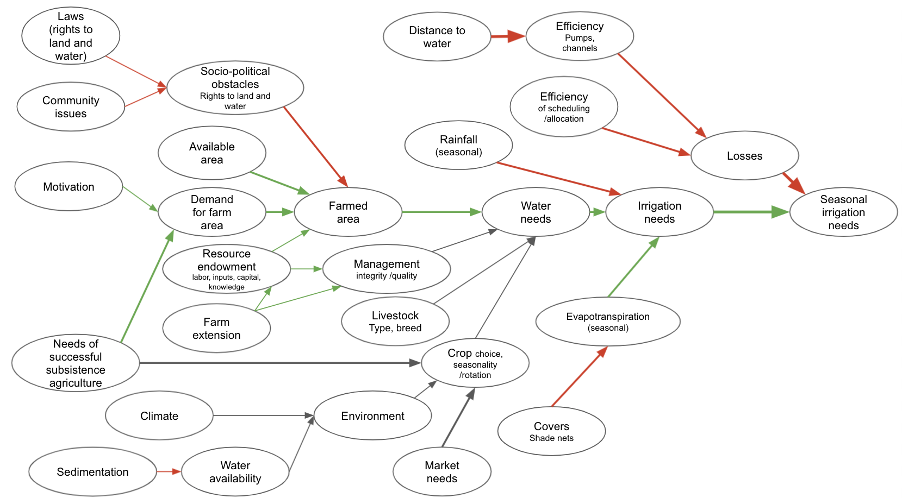
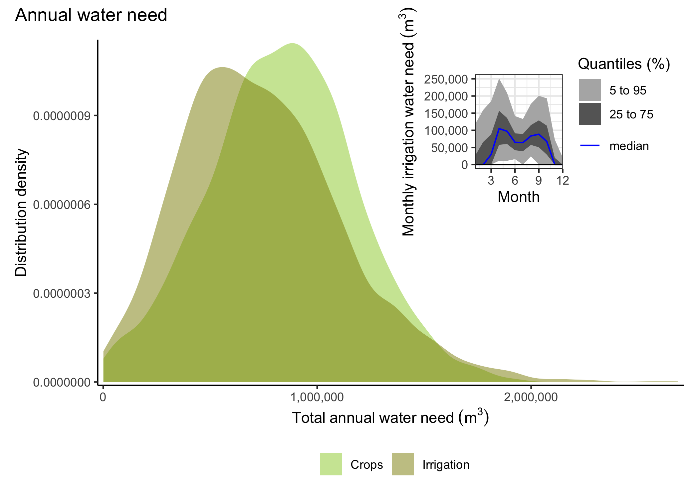
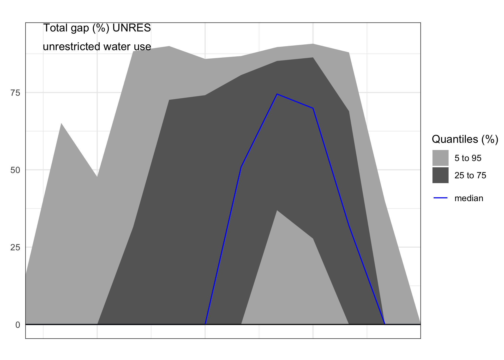
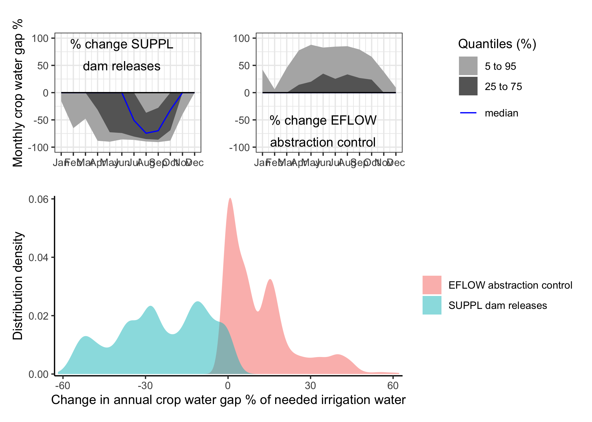
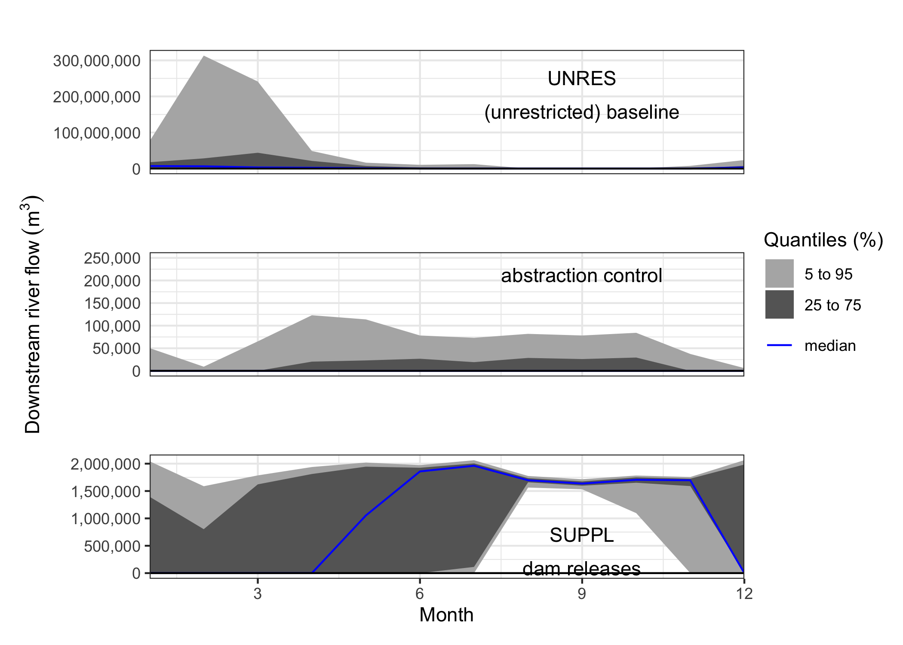

Modeling the contribution of e-flows to sustainable agriculture, food
security and livelihoods in South Africa’s Limpopo basin
================
Cory Whitney, Gordon O’Brien, Vuyisile Dlamini, Ikhothatseng Jacob
Greffiths, Chris Dickens, Eike Luedeling

We generate a holistic model to simulate the contribution of e-flows to
sustainable agriculture, food security and livelihoods. Spatially, we do
this for only a small portion of the basin as a test-case. We apply
holistic modeling approaches to generate conceptual impact pathways and
quantitative models to forecast decision outcomes (see Do, Luedeling,
and Whitney 2020; Lanzanova et al. 2019; Cory Whitney et al. 2018). This
includes collaborative model development (C. Whitney, Shepherd, and
Luedeling 2018) to assess farming futures given e-flow forecasts under
different management options. To build these simulations we use
functions from the `decisionSupport` (Luedeling et al. 2024), `dplyr`
(Wickham et al. 2023), `nasapower` (Sparks 2024), `patchwork` (Pedersen
2024), `tidyverse` (Wickham 2023b) and `Evapotranspiration` libraries in
the R programming language (R Core Team 2024).

The set.seed() function in R is used to create reproducible results when
writing code that involves creating variables that take on random
values. By using the set. seed() function, we guarantee that the same
random values are produced each time we run the code

``` r


# setting seed at 81 for the GLET-B81J-LRANC gauge at our e-flow site
set.seed(81)

# Load the necessary libraries 
# devtools::install_github("eikeluedeling/decisionSupport")
{
library(decisionSupport)
library(dplyr)
library(knitr)
library(patchwork)
library(nasapower)
library(patchwork)
library(rmarkdown)
library(tidyverse)
library(Evapotranspiration)
}
```

## The model

Decision-makers often wish to have a quantitative basis for their
decisions. However,‘hard data’ is often missing or unattainable for many
important variables, which can paralyze the decision-making processes or
lead decision-makers to conclude that large research efforts are needed
before a decision can be made. That is, many variables that decision
makers must consider cannot be precisely quantified, at least not
without unreasonable effort. The major objective of (prescriptive)
decision analysis is to support decision-making processes where decision
makers are faced with this problem. Following the principles of Decision
Analysis can allow us to make forecasts of decision outcomes without
precise numbers, as long as probability distributions describing the
possible values for all variables can be estimated.

The `decisionSupport` package implements this as a Monte Carlo
simulation, which generates a large number of plausible system outcomes,
based on random numbers for each input variable that are drawn from
user-specified probability distributions. This approach is useful for
determining whether a clearly preferable course of action can be
delineated based on the present state of knowledge without the need for
further information. If the distribution of predicted system outcomes
does not imply a clearly preferable decision option, variables
identified as carrying decision-relevant uncertainty can then be
targeted by decision-supporting research.

The `mcSimulation` function from the `decisionSupport` package can be
applied to conduct decision analysis (Luedeling et al. 2024). The
function requires three inputs:

1.  an `estimate` of the joint probability distribution of the input
    variables. These specify the names and probability distributions for
    all variables used in the decision model. These distributions aim to
    represent the full range of possible values for each component of
    the model.
2.  a `model_function` that predicts decision outcomes based on the
    variables named in a separate data table. This R function is
    customized by the user to address a particular decision problem to
    provide the decision analysis model.
3.  `numberOfModelRuns` indicating the number of times to run the model
    function.

These inputs are provided as arguments to the `mcSimulation` function,
which conducts a Monte Carlo analysis with repeated model runs based on
probability distributions for all uncertain variables. The data table
and model are customized to fit the particulars of a specific decision.

### The `estimate`

To support the model building process we design an input table to store
the `estimate` values. The table is stored locally as
`limpopo_input_table.csv` and contains many of the basic values for the
analysis. This table contains all the input variables used in the model.
Their distributions are described by 90% confidence intervals, which are
specified by lower (5% quantile) and upper (95% quantile) bounds, as
well as the shape of the distribution. This model uses four different
distributions:

1.  `const` – a constant value
2.  `norm` – a normal distribution
3.  `tnorm_0_1` – a truncated normal distribution that can only have
    values between 0 and 1 (useful for probabilities; note that 0 and 1,
    as well as numbers outside this interval are not permitted as
    inputs)
4.  `posnorm` – a normal distribution truncated at 0 (only positive
    values allowed)

For a full list of input variables with descriptions and the chosen
distributions see the table at the end of this document.

### Scenarios

The following function defines 3 scenarios:

1.  UNRES – baseline, unrestricted water use with no e-flows: This is a
    scenario without eflows. Farmers extract water according to their
    irrigation needs. Extractions are only limited by the minimum water
    level that allows operating the pumps.
2.  EFLOW – E-flow through abstraction control (without using dam
    releases) with restricted extraction: This is an eflow scenario, in
    which eflows are interpreted in a purely ecological sense. Whenever
    eflows aren’t achieved, water extraction is curtailed. There are no
    measures to add water to the river in such events. We simulate this
    scenario with our own functions and some from the `nasapower`
    (Sparks 2024) and `Evapotranspiration` (Guo, Westra, and
    Peterson 2022) packages.
3.  SUPPL – E-flows achieved through abstraction control and dam
    releases: This is an eflow scenario, in which eflows are interpreted
    as encompassing the ecological as well as the smallholder irrigation
    requirement. In case eflows aren’t naturally met, water is released
    from upstream dams to ensure eflows. Extraction by smallholder
    farmers is restricted only by the ability to operate the pumps.

### The conceptual model

<figure>

<figcaption aria-hidden="true">Model of the social effects of altered
river flows on the sustainability of livelihoods in the Limpopo
Basin</figcaption>
</figure>

### The `model_function`

The decision model is coded as an R function which takes in the
variables provided in the data table and generates a model output, such
as the Net Present Value.

In the following we use of various `decisionSupport` functions, which
use the `tidyverse` libraries (Wickham et al. 2019) including `ggplot2`
(Wickham et al. 2024), `plyr` (Wickham 2023a) and `dplyr` (Wickham et
al. 2023) among others in the [R programming
language](https://www.r-project.org/) (R Core Team 2024).

Here we generate a model as a function using `decisionSupport` library
we use the `decisionSupport` functions `vv()` to produce time series
with variation from a pre-defined mean.

``` r

source(file = "functions/limpopo_decision_function.R")
```

### Perform the Monte Carlo simulation with scenarios

Using the model function, we can perform a Monte Carlo simulation with
the `mcSimulation()` function from `decisionSupport`. This function
generates distributions of all variables in the input table as well as
the specified model outputs (see `return()` function above) by
calculating random draws in our defined `limpopo_decision_function()`.
We run a visual assessment to ensure that all the variables in the input
table are included in the model (erroneous variables listed there can
cause issues with some of the post-hoc analyses).

The `numberOfModelRuns` argument is an integer indicating the number of
model runs for the Monte Carlo simulation. Unless the model function is
very complex, 10,000 runs is a reasonable choice (for complex models,
10,000 model runs can take a while, so especially when the model is
still under development, it often makes sense to use a lower number).

We first make a scenario file:

We use NASA POWER From the POWER API

``` r
# load data from Evapotranspiration
data("constants")

# get global meteorology and surface solar energy climatology data
meteo_clim_data <- get_power(
  community = "ag",
  # Coordinates of the Letaba region
  lonlat = c(31.08, -23.7),
  pars = c("T2M_MAX", "T2M_MIN", "PRECTOTCORR"),
  dates = c("1981-01-01", "2020-12-31"),
  # Temporal API end-point for data being queried
  temporal_api = "daily"
)

# Test Check that the temperature and precipitation values make sense for the
# Letaba River region 
summary(meteo_clim_data$T2M_MAX) # maximum temperature is high
#>    Min. 1st Qu.  Median    Mean 3rd Qu.    Max. 
#>   12.93   27.98   31.40   31.27   34.59   46.48
# but within reason (low to mid 40's have been recorded)
```

We apply the Hargreaves-Samani formulation for estimating reference crop
evapotranspiration.

``` r

# choose years of assessment
years <- 1981:2009

# name variables
colnames(meteo_clim_data)[c(3:5, 8, 9, 10)] <-
  c("Year", "Month", "Day", "Tmax", "Tmin", "Precipitation")

# Load raw date and climate data with Evapotranspiration
Inputs <- ReadInputs(c("Tmin", "Tmax"), meteo_clim_data, stopmissing = c(50, 50, 50))

# Implementing the Hargreaves-Samani formulation for estimating reference crop evapotranspiration
ET <-
  ET.HargreavesSamani(
    Inputs,
    constants,
    ts = "daily",
    message = "yes",
    AdditionalStats = "yes",
    save.csv = "no"
  )

# Test
# Review ET Output
summary(ET$ET.Monthly)
#>      Index      ET$ET.Monthly   
#>  Min.   :1981   Min.   : 54.10  
#>  1st Qu.:1991   1st Qu.: 98.33  
#>  Median :2001   Median :152.18  
#>  Mean   :2001   Mean   :150.22  
#>  3rd Qu.:2011   3rd Qu.:197.66  
#>  Max.   :2021   Max.   :294.49
# monthly ET values are within expected ranges for Letaba River region
```

We use evapotranspiration data for 1980 to 2009 to build the scenarios

``` r

source(file = "functions/build_scenarios.R")

# modeled scenarios
write.csv(Scenarios, file = "data/scenarios_1980_2020.csv")
```

Here we run the model with the `scenario_mc` function cf. the
`decisionSupport` package (Luedeling et al. 2024). The function
essentially generates a Monte Carlo model with data from existing
scenarios for some of the model inputs.

``` r
source(file = "functions/limpopo_decision_function.R")
source(file = "functions/scenario_mc.R")

# run the model with the scenario_mc function 
mcSimulation_results <-
  scenario_mc(
    base_estimate = decisionSupport::estimate_read_csv("data/limpopo_input_table.csv"),
    scenarios = Scenarios, 
    # read.csv("data/scenarios_1980_2020.csv", fileEncoding ="UTF-8-BOM"),
    model_function = limpopo_decision_function,
    numberOfModelRuns = 1e2, #run 100 times (2900 with 100 simulations of 29 scenarios)
    functionSyntax = "plainNames"
  )

#save this in the data folder
write.csv(mcSimulation_results, file = "data/mcSimulation_results.csv")
```

# Results

### Water needs

General estimates

``` r

# Here the general estimates about needed water for crops
plotting_simulations <- mcSimulation_results 

# Annual crop water needs
summary(plotting_simulations$y$yearly_crop_water_need)
#>    Min. 1st Qu.  Median    Mean 3rd Qu.    Max. 
#>    2591  607890  831192  832670 1051843 2227936
# Annual irrigation needs
summary(plotting_simulations$y$yearly_irrigation_water_need)
#>    Min. 1st Qu.  Median    Mean 3rd Qu.    Max. 
#>    1569  329567  482127  509070  659023 2042893
```

As a plot

<!-- -->

Summary of monthly crop water requirements

``` r
# Load the knitr package
library(knitr)

# Initialize an empty data frame to store all summary statistics
summary_table <- data.frame(
  Month = integer(),
  Mean = numeric(),
  Median = numeric(),
  Min = numeric(),
  Max = numeric(),
  SD = numeric()
)

# Loop over each month and calculate the summary statistics
for (i in 1:12) {
  # Get the variable name dynamically
  variable_name <- paste0("cropwater_need", i)
  
  # Access the data using the variable name
  data <- plotting_simulations$y[[variable_name]]
  
  # Calculate summary statistics
  summary_stats <- data.frame(
    Month = i,
    Mean = mean(data, na.rm = TRUE),
    Median = median(data, na.rm = TRUE),
    Min = min(data, na.rm = TRUE),
    Max = max(data, na.rm = TRUE),
    SD = sd(data, na.rm = TRUE)
  )
  
  # Append the summary statistics to the table
  summary_table <- rbind(summary_table, summary_stats)
}

# Display the summary table using knitr::kable
kable(summary_table, format = "markdown")
```

| Month |     Mean |   Median |      Min |      Max |       SD |
|------:|---------:|---------:|---------:|---------:|---------:|
|     1 | 80842.05 | 79251.75 | 320.7947 | 241532.4 | 35671.50 |
|     2 | 83110.42 | 81140.39 | 257.4684 | 222068.9 | 37098.32 |
|     3 | 91136.23 | 89594.73 | 239.5191 | 295958.1 | 40149.10 |
|     4 | 92423.36 | 91711.89 | 266.0862 | 256251.3 | 39658.58 |
|     5 | 73445.37 | 72696.02 | 236.9529 | 227459.0 | 31859.39 |
|     6 | 51016.48 | 50257.59 | 151.1363 | 152357.1 | 22329.43 |
|     7 | 49174.07 | 48686.09 | 142.9728 | 134096.4 | 21351.26 |
|     8 | 60572.75 | 59900.67 | 229.5788 | 165942.1 | 26372.07 |
|     9 | 69792.03 | 68870.52 | 230.4718 | 191333.0 | 30695.42 |
|    10 | 83335.54 | 82107.62 | 260.1574 | 242462.8 | 36840.14 |
|    11 | 61085.94 | 59842.36 | 152.9162 | 179155.6 | 27374.84 |
|    12 | 36735.44 | 35385.93 | 103.1145 | 125877.7 | 17741.45 |

### Baseline vs scenarios results

<!-- -->

### Change in crop water gap

This is a plot of the change in the crop water gap from the baseline if
the intervention is put into place. It shows the percentage of water
that is lacking in comparison to the baseline scenario.

<!-- -->

Here is a plot for comparison to the baseline scenario. This is a plot
of the mean annual crop water gap (deficit in water needed for crops).
This ranges from 0 to 60 percent.

<!-- -->

Percent change in the crop water gap (deficit for crops) under the EFLOW
scenario.

### Dam releases

<!-- -->

### Stream flow

<!-- -->

## Sensitivity analysis

We use the `plsr.mcSimulation` function of the `decisionSupport` package
to run Partial Least Squares regression on the model outputs. Projection
to Latent Structures (PLS), also sometimes known as Partial Least
Squares regression is a multivariate statistical technique that can deal
with multiple colinear dependent and independent variables (Wold,
Sjöström, and Eriksson 2001). It can be used as another means to assess
the outcomes of a Monte Carlo model. We use the Variable Importance in
the Projection (VIP) scores to identify important variables. VIP scores
estimate the importance of each variable in the projection used in a PLS
model. VIP is a parameter used for calculating the cumulative measure of
the influence of individual variables on the model. Read more in [‘A
Simple Explanation of Partial Least Squares’ by Kee Siong
Ng](http://users.cecs.anu.edu.au/~kee/pls.pdf). More information on all
these procedures is contained in the [decisionSupport
manual](https://cran.r-project.org/web/packages/decisionSupport/decisionSupport.pdf),
especially under `welfareDecisionAnalysis`.

We apply the aforementioned post-hoc analysis to the `mcSimulation()`
outputs with `plsr.mcSimulation()` to determine the VIP score and
coefficients of our PLS regression models. This functions use the
outputs of the `mcSimulation()` selecting all the input variables from
the decision analysis function in the parameter `object` and then runs a
PLS regression with an outcome variable defined in the parameter
`resultName`. We also need to import the input table again to replace
the labels for the variables on the y-axis. The input table can include
a `label` and `variable` column. The standard labels (from the
`variable` column) are usually computer readable and not very nice for a
plot. The `plot_pls()` function uses the text in the `label` column as
replacement for the default text in the `variable` column.

``` r
# to ensure a clear process (not overwriting the original data) 
# rename the simulations results
mcSimulation_pls <- mcSimulation_results
# select the data for the scenario analysis 
mcSimulation_pls$x <- mcSimulation_pls$x[, !names(mcSimulation_pls$x) == "Scenario"]

pls_result_crop_water_need <- plsr.mcSimulation(object = mcSimulation_pls,
                  resultName = "yearly_crop_water_need",
                  ncomp = 1)

input_table <- read.csv("data/limpopo_input_table.csv")

# ### Irrigation demand

### No e-flows

pls_result_1 <- plsr.mcSimulation(object = mcSimulation_pls,
                  resultName = "scen1_crop_water_gap", 
                  ncomp = 1)

PLS_UNRES_baseline_crop_water_gap <- plot_pls(pls_result_1, 
                            input_table = input_table, 
                            threshold = 1) + 
  annotate(geom="text", x=1.7, y=3,
           label=expression(atop("UNRES",
                   paste("unrestricted water use")))) +
          theme(axis.text.x = element_blank(),
          axis.ticks = element_blank(),
          axis.title.x = element_blank())

### Environmental e-flows

pls_result_2 <- plsr.mcSimulation(object = mcSimulation_pls,
                  #  resultName = "Crop_water_gap_difference_2_vs_1",
                   resultName = "scen2_crop_water_gap", 
                  ncomp = 1)

Fig_PLS_EFLOW_crop_water_gap <- plot_pls(pls_result_2, 
                            input_table = input_table, 
                            threshold = 1, 
                            y_axis_name = "Model input variables") + 
  annotate(geom="text", x=1.7, y=3, 
           label=expression(atop("EFLOW", 
                   paste("abstraction control")))) + 
          theme(axis.text.x = element_blank(),
          axis.ticks = element_blank(),
          axis.title.x = element_blank())

### SUPPL dam release - Livelihoods e-flows

pls_result_3 <- plsr.mcSimulation(object = mcSimulation_pls,
                  #  resultName = "Crop_water_gap_difference_3_vs_1",  
                   resultName = "scen3_total_dam_release", 
                  ncomp = 1)

Fig_PLS_SUPPL_dam_release_crop_water_gap <- plot_pls(pls_result_3, 
                            input_table = input_table, 
                            threshold = 1, 
                            x_axis_name = "VIP")+ 
  annotate(geom="text", x=1.7, y=3, 
           label=expression(atop("SUPPL", 
                   paste("dam releases"))))  


library(patchwork)
      PLS_UNRES_baseline_crop_water_gap +
      Fig_PLS_EFLOW_crop_water_gap +
      Fig_PLS_SUPPL_dam_release_crop_water_gap +
      plot_layout(ncol = 1, guides = "collect") + 
    plot_annotation(title = "Variable Importance in the Projection (VIP)") &     
                    ggplot2::theme(legend.position="bottom") 
```

<!-- -->

``` r


ggsave("figures/Fig_8_sensitivity.png", width=7, height=10)
```

## Expected Value of Perfect Information

Here we calculate the Expected Value of Perfect Information (EVPI) using
the `multi_EVPI` function in the `decisionSupport` package. The results
show that there would be little additional value in the knowledge gained
by gathering further knowledge on any of the variables that were
included in the analysis.

``` r
# to ensure a clear process (not overwriting the original data) rename the
# simulations results
simulations_evpi_data <- mcSimulation_results

#here we subset the outputs from the mcSimulation function (y) by selecting the
#comparative mean crop water gap variables
simulations_evpi_data_table <- data.frame(simulations_evpi_data$x[1:71], simulations_evpi_data$y[118:119])

# Run evpi

results_evpi <- multi_EVPI(mc = simulations_evpi_data_table, 
                          first_out_var = "Mean_Crop_water_gap_difference_2_vs_1")
#> [1] "Processing 2 output variables. This can take some time."
#> [1] "Output variable 1 (Mean_Crop_water_gap_difference_2_vs_1) completed."
#> [1] "Output variable 2 (Mean_Crop_water_gap_difference_3_vs_1) completed."
```

The EVPI summary statistics for the mean crop water gap difference
between the baseline UNRES and EFLOW scenarios.

``` r
summary(results_evpi$Mean_Crop_water_gap_difference_2_vs_1)
#>    variable         expected_gain        EVPI_do    EVPI_dont            EVPI  
#>  Length:71          Min.   :0.01507   Min.   :0   Min.   :0.00000   Min.   :0  
#>  Class :character   1st Qu.:0.09499   1st Qu.:0   1st Qu.:0.05453   1st Qu.:0  
#>  Mode  :character   Median :0.12460   Median :0   Median :0.11261   Median :0  
#>                     Mean   :0.10702   Mean   :0   Mean   :0.08893   Mean   :0  
#>                     3rd Qu.:0.12800   3rd Qu.:0   3rd Qu.:0.12793   3rd Qu.:0  
#>                     Max.   :0.18166   Max.   :0   Max.   :0.18166   Max.   :0  
#>                     NA's   :12                                                 
#>    decision        
#>  Length:71         
#>  Class :character  
#>  Mode  :character  
#>                    
#>                    
#>                    
#> 
```

The EVPI summary statistics for the mean crop water gap difference
between the baseline UNRES and SUPPL scenarios.

``` r
summary(results_evpi$Mean_Crop_water_gap_difference_3_vs_1)
#>    variable         expected_gain         EVPI_do          EVPI_dont        
#>  Length:71          Min.   :-0.29475   Min.   :0.00000   Min.   :0.000e+00  
#>  Class :character   1st Qu.:-0.23025   1st Qu.:0.06619   1st Qu.:0.000e+00  
#>  Mode  :character   Median :-0.20941   Median :0.19995   Median :0.000e+00  
#>                     Mean   :-0.18079   Mean   :0.15025   Mean   :1.693e-05  
#>                     3rd Qu.:-0.14356   3rd Qu.:0.23001   3rd Qu.:0.000e+00  
#>                     Max.   :-0.02232   Max.   :0.29475   Max.   :1.202e-03  
#>                     NA's   :12                                              
#>       EVPI             decision        
#>  Min.   :0.000e+00   Length:71         
#>  1st Qu.:0.000e+00   Class :character  
#>  Median :0.000e+00   Mode  :character  
#>  Mean   :1.693e-05                     
#>  3rd Qu.:0.000e+00                     
#>  Max.   :1.202e-03                     
#> 
```

## Estimate values

| Description | variable | distribution | lower | upper | label |
|:---|:---|:---|---:|---:|:---|
| Precipitation in month 1 in mm | prec_1 | posnorm | 45.00 | 135.00 | Precipitation in January in mm |
| Precipitation in month 2 in mm | prec_2 | posnorm | 31.00 | 93.00 | Precipitation in February in mm |
| Precipitation in month 3 in mm | prec_3 | posnorm | 25.00 | 75.00 | Precipitation in March in mm |
| Precipitation in month 4 in mm | prec_4 | posnorm | 12.50 | 37.50 | Precipitation in April in mm |
| Precipitation in month 5 in mm | prec_5 | posnorm | 12.50 | 37.50 | Precipitation in May in mm |
| Precipitation in month 6 in mm | prec_6 | posnorm | 12.50 | 37.50 | Precipitation in June in mm |
| Precipitation in month 7 in mm | prec_7 | posnorm | 3.00 | 9.00 | Precipitation in July in mm |
| Precipitation in month 8 in mm | prec_8 | posnorm | 2.00 | 6.00 | Precipitation in August in mm |
| Precipitation in month 9 in mm | prec_9 | posnorm | 1.00 | 3.00 | Precipitation in September in mm |
| Precipitation in month 10 in mm | prec_10 | posnorm | 5.00 | 15.00 | Precipitation in October in mm |
| Precipitation in month 11 in mm | prec_11 | posnorm | 7.00 | 21.00 | Precipitation in November in mm |
| Precipitation in month 12 in mm | prec_12 | posnorm | 45.00 | 135.00 | Precipitation in December in mm |
|  |  |  | NA | NA |  |
| Reference evapotranspiration (ET0) mm/per ha month 1 (Hargreaves Samani equation with nasapower package) | ET0_1 | posnorm | 120.00 | 180.00 | Ref. evapotranspiration in January mm/month |
| Reference evapotranspiration (ET0) mm/per ha month 2 | ET0_2 | posnorm | 100.00 | 160.00 | Ref. evapotranspiration in February mm/month |
| Reference evapotranspiration (ET0) mm/per ha month 3 | ET0_3 | posnorm | 90.00 | 140.00 | Ref. evapotranspiration in March mm/month |
| Reference evapotranspiration (ET0) mm/per ha month 4 | ET0_4 | posnorm | 60.00 | 100.00 | Ref. evapotranspiration in April mm/month |
| Reference evapotranspiration (ET0) mm/per ha month 5 | ET0_5 | posnorm | 50.00 | 80.00 | Ref. evapotranspiration in May mm/month |
| Reference evapotranspiration (ET0) mm/per ha month 6 | ET0_6 | posnorm | 30.00 | 60.00 | Ref. evapotranspiration in June mm/month |
| Reference evapotranspiration (ET0) mm/per ha month 7 | ET0_7 | posnorm | 30.00 | 60.00 | Ref. evapotranspiration in July mm/month |
| Reference evapotranspiration (ET0) mm/per ha month 8 | ET0_8 | posnorm | 40.00 | 70.00 | Ref. evapotranspiration in August mm/month |
| Reference evapotranspiration (ET0) mm/per ha month 9 | ET0_9 | posnorm | 60.00 | 100.00 | Ref. evapotranspiration in September mm/month |
| Reference evapotranspiration (ET0) mm/per ha month 10 | ET0_10 | posnorm | 80.00 | 130.00 | Ref. evapotranspiration in October mm/month |
| Reference evapotranspiration (ET0) mm/per ha month 11 | ET0_11 | posnorm | 100.00 | 160.00 | Ref. evapotranspiration in November mm/month |
| Reference evapotranspiration (ET0) mm/per ha month 12 | ET0_12 | posnorm | 120.00 | 180.00 | Ref. evapotranspiration in December mm/month |
|  |  |  | NA | NA |  |
| Crop coefficient in month 1 | kc_1 | posnorm | 0.30 | 0.40 | Crop coefficient in January (%) |
| Crop coefficient in month 2 | kc_2 | posnorm | 0.40 | 0.50 | Crop coefficient in February (%) |
| Crop coefficient in month 3 | kc_3 | posnorm | 0.50 | 0.60 | Crop coefficient in March (%) |
| Crop coefficient in month 4 | kc_4 | posnorm | 0.70 | 0.80 | Crop coefficient in April (%) |
| Crop coefficient in month 5 | kc_5 | posnorm | 0.70 | 0.80 | Crop coefficient in May (%) |
| Crop coefficient in month 6 | kc_6 | posnorm | 0.60 | 0.70 | Crop coefficient in June (%) |
| Crop coefficient in month 7 | kc_7 | posnorm | 0.50 | 0.60 | Crop coefficient in July (%) |
| Crop coefficient in month 8 | kc_8 | posnorm | 0.40 | 0.50 | Crop coefficient in August (%) |
| Crop coefficient in month 9 | kc_9 | posnorm | 0.30 | 0.40 | Crop coefficient in September (%) |
| Crop coefficient in month 10 | kc_10 | posnorm | 0.30 | 0.40 | Crop coefficient in October (%) |
| Crop coefficient in month 11 | kc_11 | posnorm | 0.20 | 0.30 | Crop coefficient in November (%) |
| Crop coefficient in month 12 | kc_12 | posnorm | 0.10 | 0.20 | Crop coefficient in December (%) |
|  |  |  | NA | NA |  |
| Effective rainfall - minimum threshold | effprec_low | posnorm | 5.00 | 10.00 | Effective rainfall - minimum threshold in Letaba |
| Effective rainfall - maximum threshold | effprec_high | posnorm | 90.00 | 200.00 | Effective rainfall - maximum threshold in Letaba |
|  |  |  | NA | NA |  |
| Efficiency of water pumps | effi_pump | tnorm_0_1 | 0.90 | 0.99 | Efficiency of the water pumps (%) |
| Efficiency of irrigation scheduling and allocation | effi_sched | tnorm_0_1 | 0.89 | 0.98 | Efficiency of irrigation scheduling (%) |
| Coefficient of variation, ratio of the standard deviation to the mean (a measure of relative variability). | var_CV | posnorm | 5.00 | 20.00 | Coefficient of variation (%) |
|  |  |  | NA | NA |  |
| Total irrigable area | available_area | posnorm | 100.00 | 300.00 | Available farm area in Prieska, Ga-Selwana, and Mahale (ha) |
| Share of land that is not used because of socio-political obstacles | unused_sociopolit | tnorm_0_1 | 0.20 | 0.40 | Share of land unused due to sociopolitical obstacles (%) |
| Number of smallholder farming households | n_subsistence_farmers | posnorm | 30.00 | 200.00 | Number of smallholder farmer (hhs) |
| Farm size per subsistence households | necessary_farm_size_per_household | posnorm | 1.50 | 2.50 | Needed farm size per household (ha) |
|  |  |  | NA | NA |  |
| eflow in month 1 in m3 / month | eflow_1 | posnorm | 1658637.36 | 2487956.04 | e-flow in January in m3 / month |
| eflow in month 2 in m3 / month | eflow_2 | posnorm | 1953364.40 | 2930046.59 | e-flow in February in m3 / month |
| eflow in month 3 | eflow_3 | posnorm | 2172764.83 | 3259147.25 | e-flow in March in m3 / month |
| eflow in month 4 | eflow_4 | posnorm | 5094152.71 | 7641229.07 | e-flow in April in m3 / month |
| eflow in month 5 | eflow_5 | posnorm | 12093593.23 | 18140389.85 | e-flow in May in m3 / month |
| eflow in month 6 | eflow_6 | posnorm | 4593467.28 | 6890200.92 | e-flow in June in m3 / month |
| eflow in month 7 | eflow_7 | posnorm | 2895912.09 | 4343868.13 | e-flow in July in m3 / month |
| eflow in month 8 | eflow_8 | posnorm | 2484366.68 | 3726550.02 | e-flow in August in m3 / month |
| eflow in month 9 | eflow_9 | posnorm | 2173592.97 | 3260389.45 | e-flow in September in m3 / month |
| eflow in month 10 | eflow_10 | posnorm | 2052485.78 | 3078728.68 | e-flow in October in m3 / month |
| eflow in month 11 | eflow_11 | posnorm | 1670297.91 | 2505446.86 | e-flow in November in m3 / month |
| eflow in month 12 | eflow_12 | posnorm | 1419171.87 | 2128757.80 | e-flow in December in m3 / month |
|  |  |  | NA | NA |  |
| Minimum river flow that allows running the pumps (in m3/month) | minimum_flow_to_operate_pumps | posnorm | 50000.00 | 150000.00 | Minimum flow required by pumps m3/month |
|  |  |  | NA | NA |  |
| river flow in month 1 (Taken from base flow MCM data from 1920 to 2010 (Letaba River at EWR site EWR4 (Letaba Ranch upstream Little Letaba confluence) )) | river_flow_1 | posnorm | 3289641.29 | 14884566.58 | River flow in January in m3 / month |
| river flow in month 2 | river_flow_2 | posnorm | 3552190.55 | 28211390.25 | River flow in February in m3 / month |
| river flow in month 3 | river_flow_3 | posnorm | 3629341.05 | 24557111.18 | River flow in March in m3 / month |
| river flow in month 4 | river_flow_4 | posnorm | 3593958.87 | 18063311.23 | River flow in April in m3 / month |
| river flow in month 5 | river_flow_5 | posnorm | 3506617.70 | 11756278.83 | River flow in May in m3 / month |
| river flow in month 6 | river_flow_6 | posnorm | 3448532.21 | 8821373.46 | River flow in June in m3 / month |
| river flow in month 7 | river_flow_7 | posnorm | 3270609.32 | 7597819.59 | River flow in July in m3 / month |
| river flow in month 8 | river_flow_8 | posnorm | 2770310.63 | 6595355.44 | River flow in August in m3 / month |
| river flow in month 9 | river_flow_9 | posnorm | 2475234.52 | 5976080.25 | River flow in September in m3 / month |
| river flow in month 10 | river_flow_10 | posnorm | 2195340.50 | 5425988.65 | River flow in October in m3 / month |
| river flow in month 11 | river_flow_11 | posnorm | 2306113.10 | 6163707.61 | River flow in November in m3 / month |
| river flow in month 12 | river_flow_12 | posnorm | 2699506.90 | 7293206.41 | River flow in December in m3 / month |
|  |  |  | NA | NA |  |
| livestock water need per month | livestock_water_need | posnorm | 300.00 | 2000.00 | Water needed for watering livestock m3 / month |

This table contains the estimate values used for the Monte Carlo
analysis

This document was generated using the `rmarkdown` (Allaire et al. 2024)
and `knitr` (Xie 2024) packages in the R programming language (R Core
Team 2024).

## References

<div id="refs" class="references csl-bib-body hanging-indent"
entry-spacing="0">

<div id="ref-R-rmarkdown" class="csl-entry">

Allaire, JJ, Yihui Xie, Christophe Dervieux, Jonathan McPherson, Javier
Luraschi, Kevin Ushey, Aron Atkins, et al. 2024. *Rmarkdown: Dynamic
Documents for r*. <https://github.com/rstudio/rmarkdown>.

</div>

<div id="ref-do_decision_2020" class="csl-entry">

Do, Hoa, Eike Luedeling, and Cory Whitney. 2020. “Decision Analysis of
Agroforestry Options Reveals Adoption Risks for Resource-Poor Farmers.”
*Agronomy for Sustainable Development* 40 (3): 20.
<https://doi.org/10.1007/s13593-020-00624-5>.

</div>

<div id="ref-R-Evapotranspiration" class="csl-entry">

Guo, Danlu, Seth Westra, and Tim Peterson. 2022. *Evapotranspiration:
Modelling Actual, Potential and Reference Crop Evapotranspiration*.
<https://CRAN.R-project.org/package=Evapotranspiration>.

</div>

<div id="ref-lanzanova_improving_2019" class="csl-entry">

Lanzanova, Denis, Cory Whitney, Keith Shepherd, and Eike Luedeling.
2019. “Improving Development Efficiency Through Decision Analysis:
Reservoir Protection in Burkina Faso.” *Environmental Modelling &
Software* 115 (May): 164–75.
<https://doi.org/10.1016/j.envsoft.2019.01.016>.

</div>

<div id="ref-R-decisionSupport" class="csl-entry">

Luedeling, Eike, Lutz Goehring, Katja Schiffers, Cory Whitney, and
Eduardo Fernandez. 2024. *decisionSupport: Quantitative Support of
Decision Making Under Uncertainty*. <http://www.worldagroforestry.org/>.

</div>

<div id="ref-R-patchwork" class="csl-entry">

Pedersen, Thomas Lin. 2024. *Patchwork: The Composer of Plots*.
<https://patchwork.data-imaginist.com>.

</div>

<div id="ref-R-base" class="csl-entry">

R Core Team. 2024. *R: A Language and Environment for Statistical
Computing*. Vienna, Austria: R Foundation for Statistical Computing.
<https://www.R-project.org/>.

</div>

<div id="ref-R-nasapower" class="csl-entry">

Sparks, Adam H. 2024. *Nasapower: NASA POWER API Client*.
<https://docs.ropensci.org/nasapower/>.

</div>

<div id="ref-whitney_probabilistic_2018" class="csl-entry">

Whitney, Cory, D. Lanzanova, C. Muchiri, K. Shepherd, T. Rosenstock, M.
Krawinkel, J. R. S. Tabuti, and E. Luedeling. 2018. “Probabilistic
Decision Tools for Determining Impacts of Agricultural Development
Policy on Household Nutrition.” *Earth’s Future* 6 (3): 359–72.
<https://doi.org/10.1002/2017EF000765/full>.

</div>

<div id="ref-whitney_decision_2018-1" class="csl-entry">

Whitney, C., K. Shepherd, and E. Luedeling. 2018. “Decision Analysis
Methods Guide; Agricultural Policy for Nutrition.” *World Agroforestry
(ICRAF)* Working Paper series (275): 40.

</div>

<div id="ref-R-plyr" class="csl-entry">

Wickham, Hadley. 2023a. *Plyr: Tools for Splitting, Applying and
Combining Data*. <http://had.co.nz/plyr>.

</div>

<div id="ref-R-tidyverse" class="csl-entry">

———. 2023b. *Tidyverse: Easily Install and Load the Tidyverse*.
<https://tidyverse.tidyverse.org>.

</div>

<div id="ref-tidyverse2019" class="csl-entry">

Wickham, Hadley, Mara Averick, Jennifer Bryan, Winston Chang, Lucy
D’Agostino McGowan, Romain François, Garrett Grolemund, et al. 2019.
“Welcome to the <span class="nocase">tidyverse</span>.” *Journal of Open
Source Software* 4 (43): 1686. <https://doi.org/10.21105/joss.01686>.

</div>

<div id="ref-R-ggplot2" class="csl-entry">

Wickham, Hadley, Winston Chang, Lionel Henry, Thomas Lin Pedersen,
Kohske Takahashi, Claus Wilke, Kara Woo, Hiroaki Yutani, Dewey
Dunnington, and Teun van den Brand. 2024. *Ggplot2: Create Elegant Data
Visualisations Using the Grammar of Graphics*.
<https://ggplot2.tidyverse.org>.

</div>

<div id="ref-R-dplyr" class="csl-entry">

Wickham, Hadley, Romain François, Lionel Henry, Kirill Müller, and Davis
Vaughan. 2023. *Dplyr: A Grammar of Data Manipulation*.
<https://dplyr.tidyverse.org>.

</div>

<div id="ref-wold_pls-regression_2001" class="csl-entry">

Wold, Svante, Michael Sjöström, and Lennart Eriksson. 2001.
“PLS-Regression: A Basic Tool of Chemometrics.” *Chemometrics and
Intelligent Laboratory Systems*, PLS Methods, 58 (2): 109–30.
<https://doi.org/10.1016/S0169-7439(01)00155-1>.

</div>

<div id="ref-R-knitr" class="csl-entry">

Xie, Yihui. 2024. *Knitr: A General-Purpose Package for Dynamic Report
Generation in r*. <https://yihui.org/knitr/>.

</div>

</div>
