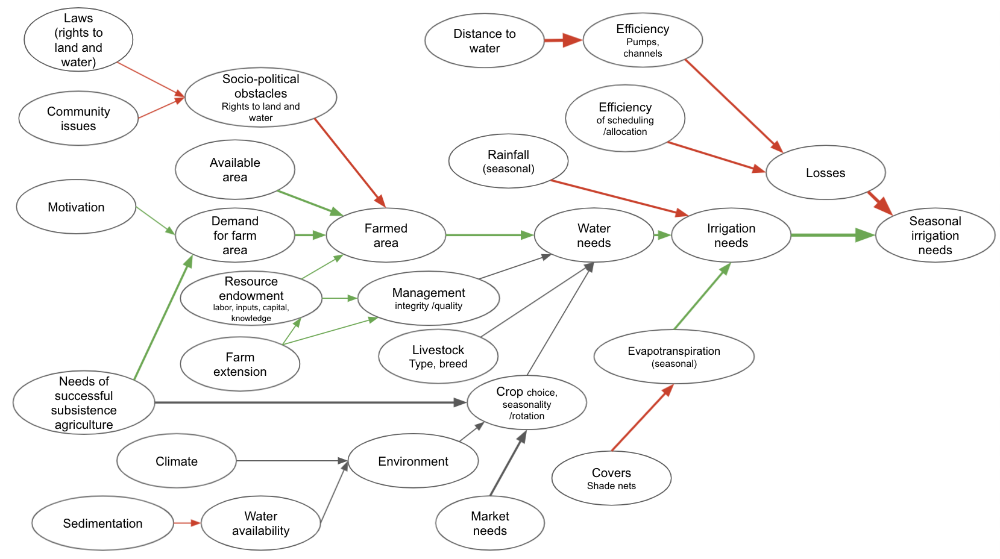

```{r, include = F}
#set global options for knitr chunks 
knitr::opts_chunk$set(
  collapse = TRUE,
  comment = "#>", 
  fig.width=5, 
  fig.height=3.5
)

library(decisionSupport)
library(dplyr)
library(patchwork)
library(tidyverse)
```

```{r, warning = F, include = F}

#Automatically write R package citation entries to a .bib file
knitr::write_bib(c(.packages(),
                   'dplyr',
                   'patchwork',
                   'plyr',
                   'tidyverse',
                   'ggplot2', 
                   'decisionSupport'), 'packages.bib')

```

## The model

Decision-makers often wish to have a quantitative basis for their decisions. However,‘hard data’ is often missing or unattainable for many important variables, which can paralyze the decision-making processes or lead decision-makers to conclude that large research efforts are needed before a decision can be made. That is, many variables decision makers must consider cannot be precisely quantified, at least not without unreasonable effort. The major objective of (prescriptive) decision analysis is to support decision-making processes faced with this problem. Following the principles of Decision Analysis can allow us to make forecasts of decision outcomes without precise numbers, as long as probability distributions describing the possible values for all variables can be estimated. 

The `decisionSupport` package implements this as a Monte Carlo simulation, which generates a large number of plausible system outcomes, based on random numbers for each input variable that are drawn from user-specified probability distributions. This approach is useful for determining whether a clearly preferable course of action can be delineated based on the present state of knowledge without the need for further information. If the distribution of predicted system outcomes does not imply a clearly preferable decision option, variables identified as carrying decision-relevant uncertainty can then be targeted by decision-supporting research.

The `mcSimulation` function from the `decisionSupport` package can be applied to conduct decision analysis [@R-decisionSupport]. The function requires three inputs:

1. an `estimate` of the joint probability distribution of the input variables. These specify the names and probability distributions for all variables used in the decision model. These distributions aim to represent the full range of possible values for each component of the model. 
1. a `model_function` that predicts decision outcomes based on the variables named in a separate data table. This R function is customized by the user to address a particular decision problem to provide the decision analysis model.  
1. `numberOfModelRuns`	indicating the number of times to run the model function.

These inputs are provided as arguments to the `mcSimulation` function, which conducts a Monte Carlo analysis with repeated model runs based on probability distributions for all uncertain variables. The data table and model are customized to fit the particulars of a specific decision.

### The `estimate`

To support the model building process we design an input table to store the `estimate` values. The table is stored locally as `limpopo_input_table.csv` and contains many of the basic values for the analysis. This table contains all the input variables used in the model. Their distributions are described by 90% confidence intervals, which are specified by lower (5% quantile) and upper (95% quantile) bounds, as well as the shape of the distribution. This model uses four different distributions:

1.	`const` – a constant value
1.	`norm` – a normal distribution
1.	`tnorm_0_1` – a truncated normal distribution that can only have values between 0 and 1 (useful for probabilities; note that 0 and 1, as well as numbers outside this interval are not permitted as inputs)
1.	`posnorm` – a normal distribution truncated at 0 (only positive values allowed)

For a full list of possible distributions, type `?random.estimate1d ` in your R console. When specifying confidence intervals for truncated distributions, note that approximately 5% of the random values should ‘fit’ within the truncation interval on either side. If there is not enough space, the function will generate a warning (usually it will still work, but the inputs may not look like you intended them to).

### The `model_function`



The decision model is coded as an R function which takes in the variables provided in the data table and generates a model output, such as the Net Present Value. 

In the following we use of various decisionSupport functions, which use the `tidyverse` libraries [@tidyverse2019] including `ggplot2` [@R-ggplot2], `plyr` [@R-plyr] and `dplyr` [@R-dplyr] among others in the [R programming language](https://www.r-project.org/) [@R-base]. 

Here we generate a model as a function using `decisionSupport` library we use the `decisionSupport` functions `vv()` to produce time series with variation from a pre-defined mean and coefficient of variation, `chance_event()` to simulate whether events occur and `discount()` to discount values along a time series adn generate a Net Present Value for our intervention comparison.

```{r model}
limpopo_decision_function <- function(x, varnames){

  ### create cost estimates ###
  # create investment cost estimates
  # add initial investment estimate as a first value to the n_years list
  intervention_cost <- c(intervention_investment_cost,vv(intervention_running_cost, n = n_years, var_CV = var_CV)[-1])
  # create base cost estimates
  baseline_cost <- vv(baseline_running_cost, n = n_years, var_CV = var_CV)

# Crops  (tons per ha)
  
  crop_yield_interv <- chance_event(chance = chance_that_crop_yields_increase, 
                                    value_if = (crop_yield_baseline + 
                                                  (crop_yield_baseline * 
                                                     amount_that_crop_yields_increase)), 
                                    value_if_not = crop_yield_baseline, 
                                    n = n_years)
  
# livestock
  
  livestock_yield_interv <- chance_event(chance = chance_that_livestock_yields_increase, 
                                   value_if = (livestock_yield_baseline + 
                                                 (livestock_yield_baseline * 
                                                    amount_that_livestock_yields_increase)), 
                                   value_if_not = livestock_yield_baseline, 
                                   n = n_years)
  
# Final values
  
net_benefit_interv <-
    (livestock_yield_interv * livestock_profit) + 
    (crop_yield_interv * crop_profit) -
    intervention_cost
  
  net_benefit_baseline <-
    (livestock_yield_baseline * livestock_profit) + 
    (crop_yield_baseline * crop_profit) - 
    baseline_cost
    
NPV_interv <-
  discount(net_benefit_interv, discount_rate, calculate_NPV = TRUE)

NPV_baseline <-
  discount(net_benefit_baseline, discount_rate, calculate_NPV = TRUE)

return(list(Interv_NPV = NPV_interv,
            NO_Interv_NPV = NPV_baseline,
            NPV_decision_do = NPV_interv - NPV_baseline,
            Cashflow_decision_do = net_benefit_interv - net_benefit_baseline))
}

```

#### Perform a Monte Carlo simulation

Using the model function above, we can perform a Monte Carlo simulation with the `mcSimulation()` function from `decisionSupport`. This function generates distributions of all variables in the input table as well as the specified model outputs (see `return()` function above) by calculating random draws in our defined `limpopo_decision_function()`. Make sure that all the variables in the input table are included in the model (erroneous variables listed there can cause issues with some of the post-hoc analyses). 

The `numberOfModelRuns` argument is an integer indicating the number of model runs for the Monte Carlo simulation. Unless the model function is very complex, 10,000 runs is a reasonable choice (for complex models, 10,000 model runs can take a while, so especially when the model is still under development, it often makes sense to use a lower number).

```{r mcSimulation}
mcSimulation_results <- decisionSupport::mcSimulation(
  estimate = decisionSupport::estimate_read_csv("limpopo_input_table.csv"),
  model_function = limpopo_decision_function,
  numberOfModelRuns = 1e3, #run 1,000 times
  functionSyntax = "plainNames"
)

```

#### Plot Net Present Value (NPV) distributions 

We can use the `plot_distributions()` function to produce one of the several plotting options for distribution outputs. This shows us an overlay of the full results of the Monte Carlo model of the decision options, i.e. the expected NPV if we choose to do the intervention `Interv_NPV` or not do the intervention `NO_Interv_NPV`.

```{r}
decisionSupport::plot_distributions(mcSimulation_object = mcSimulation_results, 
                                    vars = c("Interv_NPV", "NO_Interv_NPV"),
                                    method = 'smooth_simple_overlay', 
                                    base_size = 7)

```

We use the same function to show the distributions of the 'do' and 'do not do' decision scenarios as boxplots. This can be useful when comparing multiple outputs by illustrating the spread of the data resulting from the decision model. Boxplots show the median (central line), the 25^th^ and 75^th^ percentiles (sides of boxes) and any outliers (light circles outside of boxes). 

```{r plot_distributions_boxplot}
decisionSupport::plot_distributions(mcSimulation_object = mcSimulation_results, 
                                    vars = c("Interv_NPV",
                                    "NO_Interv_NPV"),
                                    method = 'boxplot')
```


We can use the same function for the value of the decision (difference in NPV between do and do not do). This is more helpful for us since it shows us the outcome distribution of the decision itself. 

```{r plot_distributions_box_dens}
decisionSupport::plot_distributions(mcSimulation_object = mcSimulation_results, 
                                    vars = "NPV_decision_do",
                                    method = 'boxplot_density')
```


#### Cashflow analysis

Here we plot the distribution of annual cashflow over the entire simulated period for the intervention. For this we use the `plot_cashflow()` function which uses the specified cashflow outputs from the `mcSimulation()` function (in our case `Cashflow_decision_do`) to show cashflow over time.

```{r plot_cashflow}
plot_cashflow(mcSimulation_object = mcSimulation_results, cashflow_var_name = "Cashflow_decision_do")

```

#### Projection to Latent Structures (PLS) analysis


Projection to Latent Structures (PLS), also sometimes known as Partial Least Squares regression is a multivariate statistical technique that can deal with multiple colinear dependent and independent variables [@wold_pls-regression_2001]. It can be used as another means to assess the outcomes of a Monte Carlo model. Read more in ['A Simple Explanation of Partial Least Squares' by Kee Siong Ng](http://users.cecs.anu.edu.au/~kee/pls.pdf).

Variable Importance in Projection (VIP) scores estimate the importance of each variable in the projection used in a PLS mode. VIP is a parameter used for calculating the cumulative measure of the influence of individual $X$-variables on the model. For a given PLS dimension, $a$, the squared PLS weight $(Wa)2$ of that term is multiplied by the explained sum of squares ($SS$) of that $PLS$ dimension; and the value obtained is then divided by the total explained $SS$ by the PLS model and multiplied by the number of terms in the model. The final $VIP$ is the square root of that number.

$VIP_{PLS} = K\times (\frac{[\sum_{a=1}^{A}(W_{a}^{2} \times SSY_{comp,a})]}{SSY_{cum}})$

Technically, VIP is a weighted combination overall components of the squared PLS weights ($Wa$), where $SSY_{comp,a}$ is the sum of squares of $Y$ explained by component $a$, $A$ is the total number of components, and $K$ is the total number of variables. The average VIP is equal to 1 because the $SS$ of all VIP values is equal to the number of variables in $X$. A variable with a VIP Score close to or greater than 1 (one) can be considered important in given model. The input is a PLS model and the output is a set of column vectors equal in length to the number of variables included in the model. See @galindo-prieto_variable_2014 for a detailed description of variations of VIP analysis.


We apply a post-hoc analysis to the `mcSimulation()` outputs with `plsr.mcSimulation()` to determine the Variable Importance in the Projection (VIP) score and coefficients of a Projection to Latent Structures (PLS) regression model. This function uses the outputs of the `mcSimulation()` selecting all the input variables from the decision analysis function in the parameter `object` and then runs a PLS regression with an outcome variable defined in the parameter `resultName`. We use the code `names(mcSimulation_results$y)[3]` to select the outcome variable `r names(mcSimulation_results$y)[3]`, which is the third element of the list `y` in our `mcSimulation_results` outputs (this must be a character element). 

```{r}
pls_result <- plsr.mcSimulation(object = mcSimulation_results,
                  resultName = names(mcSimulation_results$y)[3], ncomp = 1)

```

We run the `plot_pls()` on the results from `plsr.mcSimulation()` with a number of standard settings. The length of the bars is equal to VIP with a vertical line at '1' on the x-axis indicating a standard cut-off for VIP used for variable selection [@Whitney2017]. The overall plot only shows those variables with a VIP > 0.8, which is the common threshold for variable selection [@Lanzanova2019, @Luedeling2016]. The colors of the bars represent the positive or negative coefficient of the given input variable with the output variable.

Here we import the input table again to replace the labels for the variables on the y-axis. The input table can include a 'label' and 'variable' column. The standard labels (from the 'variable' column) are usually computer readable and not very nice for a plot. The `plot_pls()` function uses the text in the 'label' column as replacement for the default text in the 'variable' column.  

```{r}
input_table <- read.csv("limpopo_input_table.csv")

plot_pls(pls_result, input_table = input_table, threshold = 0)

```

#### Value of Information (VoI) analysis

We calculate Value of Information (VoI) analysis with the Expected Value of Perfect Information (EVPI). EVPI measures the expected opportunity loss that is incurred when the decision-maker does not have perfect information about a particular variable. EVPI is determined by examining the influence of that variable on the output value of a decision model. 

We use the function `data.frame()` to transform the x and y outputs of the `mcSimulation()` function for EVPI calculation. We use the `multi_EVPI()` function to calculate the EVPI for multiple independent variables. For the first_out_var argument we choose 'intervention_mngmt_audit_cost' from the input table since this is the first variable after the NPV and cashflow model outputs, which we would like to exclude from the EVPI analysis.

```{r evpi, message = FALSE}
#here we subset the outputs from the mcSimulation function (y) by selecting the correct variables
# this should be done by the user (be sure to run the multi_EVPI only on the variables that the user wants)
mcSimulation_table <- data.frame(mcSimulation_results$x, mcSimulation_results$y[1:3])

evpi <- multi_EVPI(mc = mcSimulation_table, first_out_var = "Interv_NPV")
```

We use the function `plot_evpi()` on the results from `multi_EVPI()` to plot the Expected Value of Perfect Information (EVPI). Here we show the results with the standard settings. The length of the bars is equal to EVPI.

```{r evpi_plot}

plot_evpi(evpi, decision_vars = "NPV_decision_do")

```

Finally, we provide a single function for a quick assessment. The `compound_figure()` function can be used to run the full decision assessment for a simple binary decision ('do' or 'do not do').

```{r compound_figure, fig.width=7, fig.height=4}
compound_figure(mcSimulation_object = mcSimulation_results, input_table = input_table, plsrResults = pls_result, EVPIresults = evpi, decision_var_name = "NPV_decision_do", cashflow_var_name = "Cashflow_decision_do", base_size = 7)

```

### Expected Value of Perfect Information (EVPI) 

There is always some degree of uncertainty surrounding a decision, because there is always a chance that the decision turns out to be wrong. EVPI measures the expected cost of that uncertainty where hypothetical access to perfect information can eliminate the possibility of making the wrong decision. Please watch the following talk from the Fifth European Agroforestry Conference on defining research priorities in complex agroforestry systems [@schiffers_defining_2021] to see more about the application of value of information analysis. 

Technically we assess the possibility of making the wrong decision with a payoff matrix $Rij$ with the row index $i$ describing a choice and the column index $j$ describing a random variable that the decision maker does not yet have knowledge of, that has probability $pj$ of being in state $j$. If the decision maker has to choose $i$ without knowing the value of $j$, the best choice is the one that maximizes the expected value:

${\mbox{EMV}}=\max _{i}\sum _{j}p_{j}R_{ij}$

where $\sum _{j}p_{j}R_{ij}$ is the expected payoff for action $i$ i.e. the expectation value, and ${\mbox{EMV}}=\max _{i}$ is choosing the maximum of these expectations for all available actions. 

However, with perfect knowledge of $j$, the decision maker would choose a value of $i$ that optimizes the expectation for that specific $j$. Therefore, the expected value given perfect information is

${\mbox{EV}}|{\mbox{PI}}=\sum _{j}p_{j}(\max _{i}R_{ij})$

where $p_{j}$ is the probability that the system is in state $j$, and $R_{ij}$ is the pay-off if one follows action $i$ while the system is in state $j$. Here $(\max_{i}R_{ij})$ indicates the best choice of action $i$ for each state $j$.

The expected value of perfect information is the difference between these two quantities,

${\mbox{EVPI}}={\mbox{EV}}|{\mbox{PI}}-{\mbox{EMV}}$

This difference describes, in expectation, how much larger a value the decision maker can hope to obtain by knowing $j$ and picking the best $i$ for that $j$, as compared to picking a value of $i$ before $j$ is known. Since $EV|PI$ is necessarily greater than or equal to $EMV$, $EVPI$ is always non-negative.

### Addendum

The objective of the procedures used in the `decisionSupport` package is to make it easier for analysts to produce decision-relevant information that adequately reflects the imperfect nature of the information we usually have. Adding  probabilistic elements to a simulation adds substantial value to an analysis. Mostly, it avoids making spurious assumptions, replacing uncertainty with ‘best bets’ and producing results that do not reflect the knowledge limitations that make decision-making so challenging. More information on all this is contained in the [decisionSupport manual](https://cran.r-project.org/web/packages/decisionSupport/decisionSupport.pdf), especially under `welfareDecisionAnalysis`.

### References

